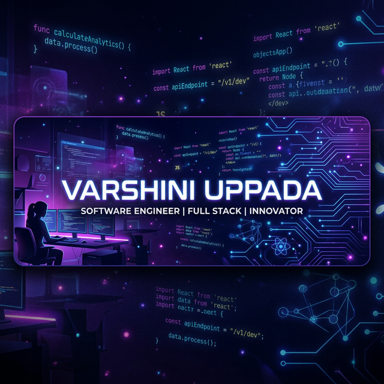

<!-- ╔══════════════════════════════════════════════════════════╗ -->
<!--        VARSHINI UPPADA  ·  PREMIUM GITHUB PROFILE        -->
<!-- ╚══════════════════════════════════════════════════════════╝ -->

<!-- ══════════════  AI HERO BANNER  ══════════════ -->

  

<!-- ══════════════  ANIMATED WAVE DIVIDER  ══════════════ -->

 

<!-- ══════════════  NAME + TAGLINE  ══════════════ -->

# 👩‍💻 Varshini Uppada

### *Backend Developer · AI/ML Explorer · Cloud Enthusiast*

 

<!-- ══════════════  ANIMATED CONTACT BADGES  ══════════════ -->

&nbsp;
&nbsp;
&nbsp;
&nbsp;

 

<!-- ══════════════  HIGHLIGHT STATS  ══════════════ -->

&nbsp;
&nbsp;

 

<!-- ══════════════  ANIMATED SECTION: TECH STACK  ══════════════ -->

  

 

| 💻 Languages | ⚙️ Backend | 🌐 Frontend |
|:---:|:---:|:---:|
|       |     |    |

 

| 🗄️ Databases | ☁️ Cloud & DevOps | 🤖 AI / ML |
|:---:|:---:|:---:|
|     |      |      |

 

<!-- ══════════════  ANIMATED SECTION: EXPERIENCE  ══════════════ -->

  

 

<!-- Infosys Card -->
<table width="90%">
<tr>
<td align="left" style="padding:16px">

**🟣 Python Developer Intern &nbsp;|&nbsp; Infosys Springboard**

| Achievement | Impact |
|:---|:---:|
| 🔧 Built 10+ RESTful APIs using Django REST Framework | ✅ Production-ready |
| ⚡ Redis caching + query indexing | **30% faster** response |
| 🚀 Implemented CI/CD pipelines | **40% faster** deploy |
| 🗄️ Optimised PostgreSQL under concurrent load | ✅ High throughput |
| 🐳 Containerised applications | Docker ✅ |

</td>
</tr>
</table>

 

<!-- Bluestock Card -->
<table width="90%">
<tr>
<td align="left" style="padding:16px">

**🔵 Software Developer Intern &nbsp;|&nbsp; Bluestock**

| Achievement | Impact |
|:---|:---:|
| 🔧 Built 3 backend modules in Python & C++ | **18% efficiency** gain |
| 🛠️ Refactored legacy code | ✅ Better modularity |
| 🐞 Resolved critical defects | **20% error** reduction |

</td>
</tr>
</table>

 

<!-- HackerRank Card -->
<table width="90%">
<tr>
<td align="left" style="padding:16px">

**🟡 Software Developer Intern &nbsp;|&nbsp; HackerRank**

| Achievement | Impact |
|:---|:---:|
| 🏗️ Designed scalable OOP-based solutions | ✅ Production quality |
| 🐳 Docker containerisation | ✅ Env consistency |

</td>
</tr>
</table>

 

<!-- ══════════════  ANIMATED SECTION: PROJECTS  ══════════════ -->

  

 

| &nbsp; | Project | Stack | Key Result |
|:---:|:---|:---|:---:|
| 🔗 | **Scalable URL Shortener** | Django · PostgreSQL · Redis | **40% latency ↓** |
| 🧠 | **Real-Time Sentiment Analysis** | TensorFlow · Scikit-learn · NLP | **85% accuracy** |
| 👥 | **Collaborative Code Editor** | WebSocket · Python | Real-time sync + conflict handling |
| 📦 | **E-Commerce Price Tracker** | Python · Automation | **500+ products** tracked |

 

<!-- ══════════════  ANIMATED SECTION: EDUCATION  ══════════════ -->

  

 

🏛️ &nbsp; **Satya Institute of Technology and Management**
 
📘 &nbsp; B.Tech — Electronics & Communication Engineering

 

&nbsp;&nbsp;

 

<!-- ══════════════  ANIMATED SECTION: CONNECT  ══════════════ -->

  

 

&nbsp;&nbsp;
&nbsp;&nbsp;

 

<!-- ══════════════  ANIMATED FOOTER WAVE  ══════════════ -->

  

